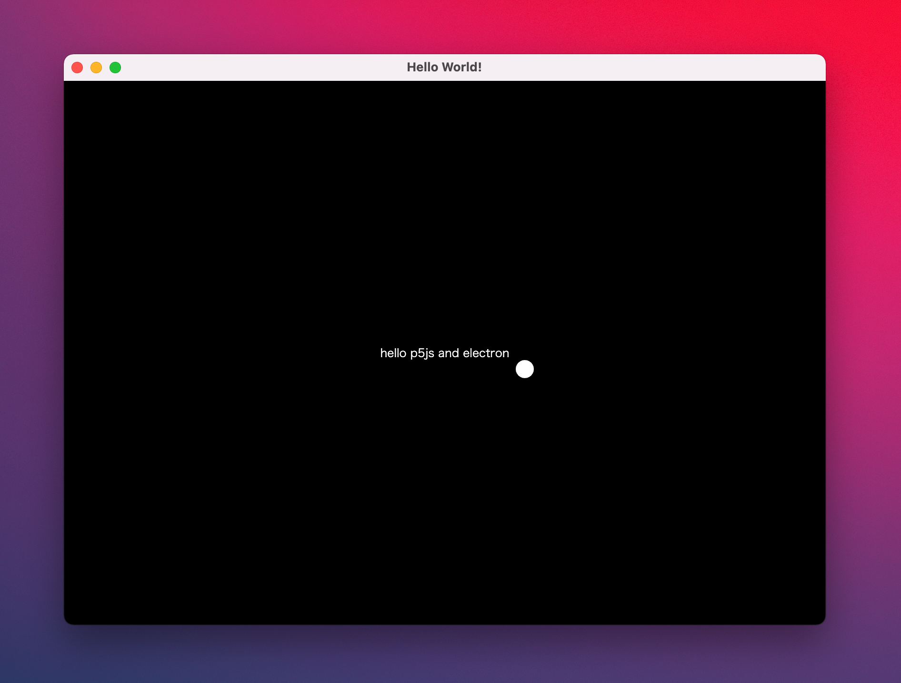

# Electron Starter Template with p5js
Simple startup template for Electron with p5js.

## Install 
1. git clone https://github.com/TetsuakiBaba/p5ElectronStarterTemplate.git
2. cd p5ElectronStarterTemplate
3. npm install 
4. npm start
---
## Build a package
### for macOS
 * npm run build-mac

### for Windows
 * npm run build-win

---
## Dependencies (npm)
 * electron
 * electron-builder